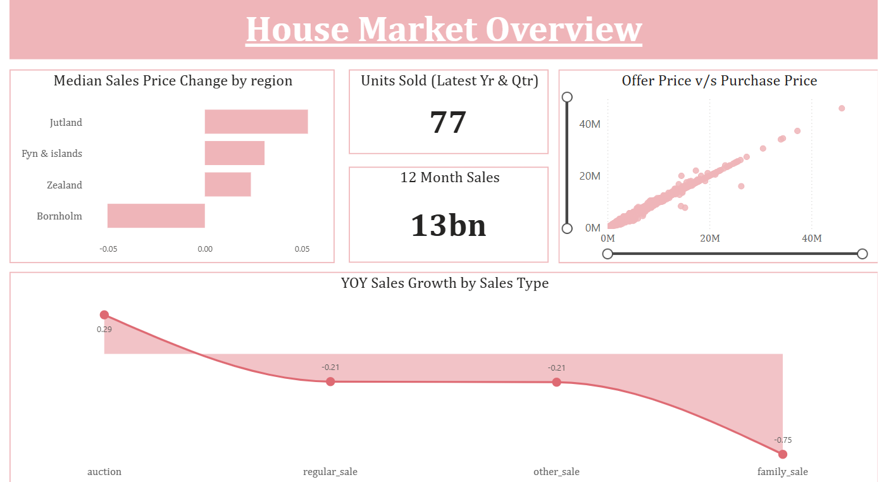

# 🏠 House Market Analysis – Power BI Dashboard
Dashboard Link - https://app.powerbi.com/groups/me/reports/8d3826ee-6260-4b33-916a-e8db11966aa7/c7e9a5a305858d9ce1b5?experience=power-bi 

## 📌 Problem Statement

The real estate market is influenced by multiple factors such as location, property type, economic indicators, and sales mechanisms. However, stakeholders often lack a consolidated, interactive view to understand **price trends, regional performance, sales growth, and the impact of macroeconomic factors** on housing prices.

The objective of this project is to:

* Analyze house sales data across regions and property types
* Identify pricing patterns and market performance
* Compare offer prices vs actual purchase prices
* Understand how economic indicators like **interest rate, inflation, and bond yields** relate to housing prices
* Provide a **decision-support dashboard** for market monitoring and insights

## 📊 Data Source

* **Google BigQuery**

### Key Data Fields

* Property details: `house_type`, `year_build`, `no_rooms`, `sqm`, `sqm_price`
* Transaction details: `purchase_price`, `%_change_between_offer_and_purchase`, `sales_type`
* Location hierarchy: `area`, `city`, `region`, `zip_code`
* Time dimensions: `date`, `year`, `quarter`, `month`
* Economic indicators:

  * `nom_interest_rate%`
  * `dk_ann_infl_rate%`
  * `yield_on_mortgage_credit_bonds%`

## 🔍 Analysis Performed

### 1️⃣ Market Overview Analysis

* **Median Sales Price Change by Region**

  * Identified regions with positive and negative price momentum
* **Units Sold (Latest Year & Quarter)**

  * Snapshot of recent market activity
* **12-Month Total Sales Value**

  * Overall transaction value trend
* **Offer Price vs Purchase Price**

  * Scatter analysis to understand negotiation gaps and pricing efficiency
* **YoY Sales Growth by Sales Type**

  * Compared auction, regular sale, family sale, and other sale types
 
    

### 2️⃣ Regional Sales Performance

* **Sales by Region**

  * Compared total sales value across regions
* **Average Price per SQM by Region**

  * Highlighted cost concentration and affordability differences
* **Offer-to-SQM Price Ratio by Sales Type**

  * Evaluated pricing effectiveness across transaction types

### 3️⃣ Property-Type Insights

* **Average Offer Price vs Purchase Price by House Type**

  * Assessed pricing differences for villas, apartments, townhouses, farms, and summerhouses
* **Average SQM and SQM Price by House Type**

  * Compared property sizes and price density
* **Macroeconomic Indicators by House Type**

  * Analyzed inflation, interest rate, and mortgage bond yield patterns

### 4️⃣ Influencer & Segmentation Analysis

* Used Power BI’s **Key Influencers** visual to identify:

  * Factors that increase or decrease purchase price
  * Segments contributing to higher property valuations

## 🛠 Tools & Technologies Used

* **Power BI** – Data modeling, DAX, and interactive dashboard creation
* **Google BigQuery** – Cloud-based data source
* **SQL** – Data extraction and preparation

## 📈 Key Insights

* Regional disparities exist in both **sales volume and price growth**
* Offer prices are generally close to purchase prices, indicating an efficient market with limited negotiation gaps
* Apartments and villas show higher **price per SQM**, while farms and summerhouses offer larger areas at lower density
* Economic indicators show observable variation across house types, influencing affordability and demand

## 🚀 Project Outcome

This dashboard provides a **holistic, decision-ready view** of the housing market, enabling users to:

* Track market performance
* Compare regional and property-type trends
* Understand economic impacts on housing prices
* Support data-driven real estate and investment decisions

